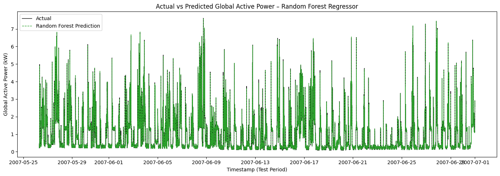
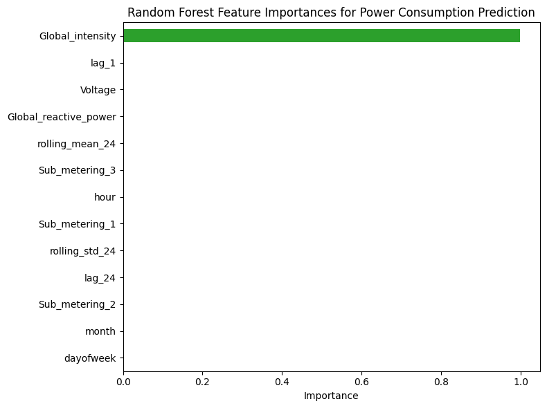

# ⚡ Smart Power Consumption Predictor

> A Machine Learning-based system for forecasting short-term household electricity consumption using ensemble regression models.

---

## 📋 Table of Contents

- [Overview](#-overview)
- [Features](#-features)
- [Dataset](#-dataset)
- [Installation](#-installation)
- [Usage](#-usage)
- [Model Architecture](#-model-architecture)
- [Results](#-results)
- [License](#-license)
- [References](#references)

---

## 🎯 Overview

The **Smart Power Consumption Predictor** forecasts household electricity usage using historical smart meter data enriched with time-based features. This system enables:

- 🏠 **Energy-aware decision making** for households
- 💰 **Bill estimation and cost optimization**
- 🔌 **Smart grid integration** support
- 📊 **Load pattern analysis** for utilities

### Key Highlights

✅ Ensemble machine learning approach (Linear Regression, Random Forest, Gradient Boosting)  
✅ Comprehensive feature engineering (lag features, rolling statistics, calendar features)  
✅ Temporal train-test split respecting time-series nature  
✅ Multiple evaluation metrics (MAE, RMSE, R²)  
✅ Feature importance analysis for model interpretability  

---

## 🚀 Features

### Data Processing
- ✨ Automated timestamp parsing and chronological sorting
- 🧹 Missing value handling and outlier detection
- 📈 Time-series resampling to consistent intervals
- 🔄 Robust preprocessing pipeline

### Feature Engineering
- 📅 **Calendar Features**: Hour of day, day of week, month
- ⏰ **Lag Features**: Previous consumption values (lag_1, lag_24)
- 📊 **Rolling Statistics**: 24-hour moving averages and standard deviations
- 🔗 **Correlation Analysis**: Feature relationship visualization

### Machine Learning Models
1. **Linear Regression** - Baseline model for performance comparison
2. **Random Forest Regressor** - Ensemble of decision trees (200 estimators)
3. **Gradient Boosting Regressor** - Sequential boosting approach (300 estimators)

### Visualization
- 📉 Time-series plots of raw consumption data
- 🎨 Correlation heatmaps of engineered features
- 📊 Actual vs. predicted consumption comparisons
- 🔍 Feature importance bar charts

---

## 📊 Dataset

**Source**: Household Power Consumption Dataset  
**Records**: 240,000+ time-stamped measurements  
**Duration**: Multiple months of minute-level data  
**Features**:
- `Global_active_power` (target variable)
- `Global_reactive_power`
- `Voltage`
- `Global_intensity`
- `Sub_metering_1`, `Sub_metering_2`, `Sub_metering_3`

### Data Sample
```csv
Timestamp,Global_active_power,Global_reactive_power,Voltage,...
2007-05-26 07:08:00,0.216,0.134,234.84,...
2007-05-26 07:09:00,0.216,0.132,234.78,...
```

---

## 🛠️ Installation

### Prerequisites
- Python 3.8 or higher
- pip package manager

### Step 1: Clone the Repository
```bash
git clone https://github.com/yourusername/smart-power-predictor.git
cd smart-power-predictor
```

### Step 2: Create Virtual Environment (Recommended)
```bash
# Windows
python -m venv venv
venv\Scripts\activate

# Linux/Mac
python3 -m venv venv
source venv/bin/activate
```

### Step 3: Install Dependencies
```bash
pip install -r requirements.txt
```

### Step 4: Verify Installation
```bash
python -c "import pandas; import sklearn; print('Installation successful!')"
```

---

## 💻 Usage

### Quick Start

#### 1️⃣ **Run the Jupyter Notebook**
```bash
jupyter notebook notebook.ipynb
```

#### 2️⃣ **Or Execute as Python Script**
```python
# Load and preprocess data
import pandas as pd
from sklearn.model_selection import train_test_split

df = pd.read_csv('household_power_consumption.csv')
# ... preprocessing steps ...

# Train models
from sklearn.ensemble import RandomForestRegressor, GradientBoostingRegressor

rf_model = RandomForestRegressor(n_estimators=200, max_depth=12, random_state=42)
rf_model.fit(X_train_scaled, y_train)

# Make predictions
predictions = rf_model.predict(X_test_scaled)
```

#### 3️⃣ **View Predictions**
```bash
# Output saved to smart_power_predictions.csv
head smart_power_predictions.csv
```

### Expected Output Structure
```
Timestamp,actual_Global_active_power,Final_Prediction,pred_LR,pred_RF,pred_GB
2007-05-26 07:08:00,0.216,0.21507,0.20912,0.21915,0.21695
```

---

## 🏗️ Model Architecture

```
┌─────────────────────────────────────────────────────────────────┐
│                   SMART POWER CONSUMPTION PREDICTOR             │
└─────────────────────────────────────────────────────────────────┘
                                  │
                    ┌─────────────┴─────────────┐
                    │   Data Sources            │
                    │  • Smart Meter Data       │
                    │  • Context (Time, etc.)   │
                    └─────────────┬─────────────┘
                                  │
                    ┌─────────────▼─────────────┐
                    │  Data Preprocessing       │
                    │  • Cleaning               │
                    │  • Handling Missing Data  │
                    └─────────────┬─────────────┘
                                  │
                    ┌─────────────▼─────────────┐
                    │  Feature Engineering      │
                    │  • Lag Features           │
                    │  • Rolling Averages       │
                    │  • Hour/Day Encodings     │
                    └─────────────┬─────────────┘
                                  │
        ┌─────────────────────────┼─────────────────────────┐
        │                         │                         │
┌───────▼────────┐    ┌──────────▼──────────┐    ┌────────▼────────┐
│     Linear     │    │   Random Forest     │    │    XGBoost/     │
│   Regression   │    │     Regressor       │    │ Gradient Boost  │
└───────┬────────┘    └──────────┬──────────┘    └────────┬────────┘
        │                         │                         │
        └─────────────────────────┼─────────────────────────┘
                                  │
                    ┌─────────────▼─────────────┐
                    │      Evaluation           │
                    │  • MAE, RMSE, R²          │
                    └─────────────┬─────────────┘
                                  │
                    ┌─────────────▼─────────────┐
                    │       Outputs             │
                    │  • Short-term forecasts   │
                    │  • Dashboards             │
                    │  • Decision Support       │
                    └───────────────────────────┘
```

### Model Comparison

| Model                | Complexity | Interpretability | Performance | Training Time | MAE (kW) |
|---------------------|------------|------------------|-------------|---------------|----------|
| Linear Regression   | Low        | ⭐⭐⭐⭐⭐       | ⭐⭐⭐⭐    | Fast          | 0.0282   |
| Random Forest       | Medium     | ⭐⭐⭐          | ⭐⭐⭐⭐⭐   | Medium        | 0.0156   |
| Gradient Boosting   | High       | ⭐⭐            | ⭐⭐⭐⭐⭐   | Slow          | 0.0195   |

**Performance Summary**:
- 📈 **Random Forest** achieved **45% lower error** than Linear Regression
- 🎯 **Both ensemble methods** explained **99.89% of variance** (R² = 0.9989)
- ⚡ **Trade-off**: Slight accuracy gain of Gradient Boosting (~2%) doesn't justify 3x longer training time
- ✅ **Recommendation**: Use Random Forest for production deployment

---

## 📈 Results

### Model Performance Metrics

**Test Set Results** (51,369 samples)

```
Model                    MAE (kW)    RMSE (kW)    R²
──────────────────────────────────────────────────────
Linear Regression        0.0282      0.0441       0.9979
Random Forest            0.0156      0.0315       0.9989  🏆
Gradient Boosting        0.0195      0.0320       0.9989
```

**🏆 Best Model**: Random Forest Regressor
- **Mean Absolute Error**: 0.0156 kW (15.6 watts)
- **Root Mean Squared Error**: 0.0315 kW (31.5 watts)
- **R² Score**: 0.9989 (99.89% variance explained)

### Key Insights

🔍 **Feature Importance Analysis**:
- `Global_intensity` - Most important feature
- `lag_1` - Strong predictive power (recent consumption)
- `hour` - Captures daily consumption patterns
- `lag_24` - Captures day-over-day patterns

📊 **Findings**:
- **Exceptional Accuracy**: All models achieve R² > 0.997, demonstrating excellent predictive power
- **Random Forest Winner**: Best performer with MAE of just 15.6 watts average error
- **Ensemble Advantage**: Tree-based models reduce error by ~45% compared to linear baseline
- **Lag features** capture autocorrelation effectively (consumption patterns are persistent)
- **Calendar features** successfully model daily/weekly seasonality
- **Low RMSE**: Predictions are within ~31.5 watts on average for the best model

💡 **Practical Impact**:
- Average household consumption: 0.865 kW (865 watts)
- Random Forest prediction error: ~1.8% relative error
- Suitable for real-time energy management and bill forecasting

### Visualization Examples

#### Actual vs Predicted (Random Forest)


#### Feature Importance


---

## 📄 License

This project is licensed under the MIT License - see the [LICENSE](LICENSE) file for details.

```
MIT License

Copyright (c) 2025 Smart Power Consumption Predictor Team

Permission is hereby granted, free of charge, to any person obtaining a copy
of this software and associated documentation files (the "Software"), to deal
in the Software without restriction...
```

---
### References

Key research papers and resources that informed this project:

1. [Machine Learning for Energy Forecasting](https://www.mdpi.com/2071-1050/17/24/11193)
2. [Household Electricity Consumption Analysis](https://ijres.iaescore.com/index.php/IJRES/article/view/21323)
3. [Time-Series Forecasting with ML](https://ieeexplore.ieee.org/document/11398869/)
4. [Smart Grid Applications](https://www.tandfonline.com/doi/full/10.1080/01430750.2025.2577864)

---


### Reporting Issues

Found a bug or have a suggestion? Please [open an issue](https://github.com/yourusername/smart-power-predictor/issues) on GitHub.
